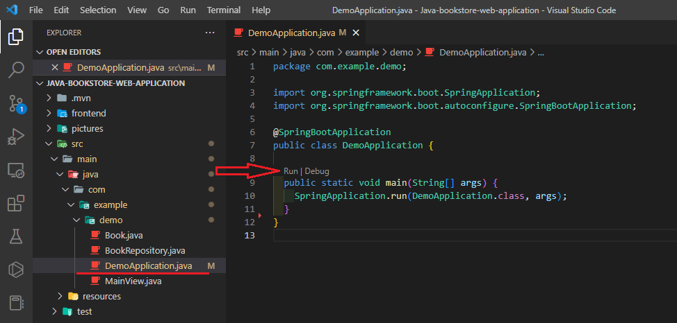
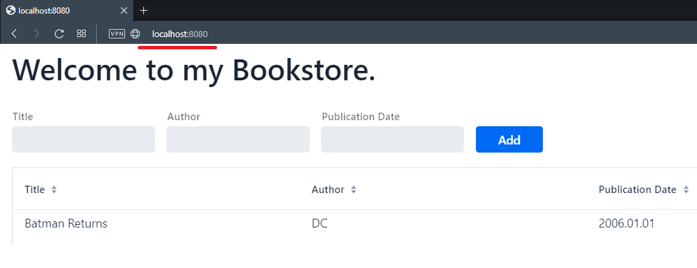

# Java-bookstore-web-application
My attempt to create a web application using Java.

Tu run app go to 'DemoApplication.java' press F5 or 'run' button.

Go to http://localhost:8080 to see the web application in your browser.

This application needs a lot of improvements.
1. Use Database, for example [mongodb](https://account.mongodb.com/account/login)
2. Create new Java project using API. (something similar to [Bookstore-API](https://github.com/kristaps-m/Bookstore-API))